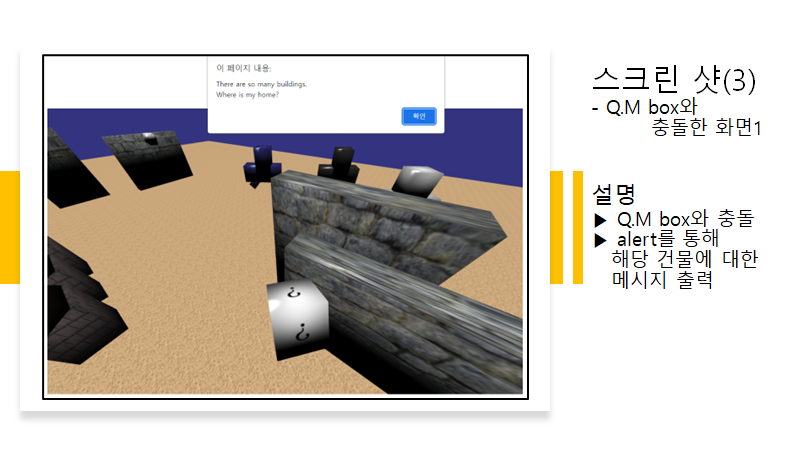

# I miss going to my HOME!
'컴퓨터 그래픽스' 과목 프로젝트 (WebGL)

### Introduce
* 주제: 우리 집을 찾아라!
* 본가 동네를 모델링하여 구현

### skills
* Texture Mapping
* Phong Shading
* Perspective Viewing
* Collision → alert massage
* 'Moving' Obstacles

### User Interface
* '상' 이동
  * W, w
  * Up Key
  * Up Button '▲'
* '하' 이동
  * S, s
  * Down Key
  * Down Button '▼'
* '좌' 이동
  * A, a
  * Left Key
  * Left Button '◀'
* '우' 이동
  * D, d
  * Right Key
  * Right Button '▶'
  
### Improvement points
* 바닥에 구분 선 추가
* 건물 텍스쳐 매핑
* 추상화 → 구체화

### Images

